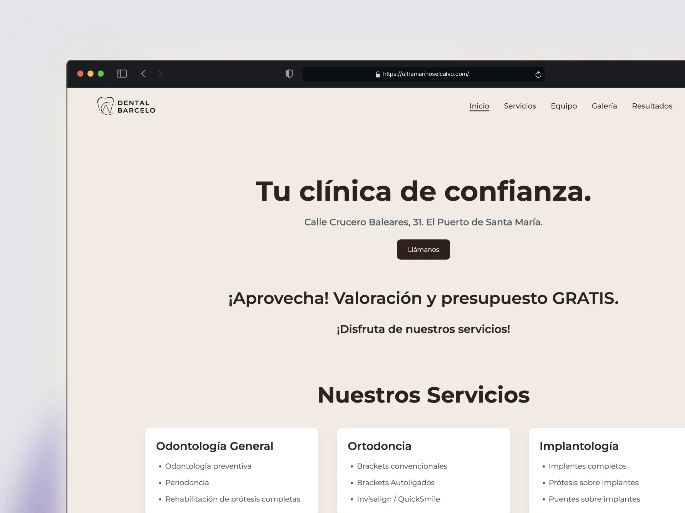

## 🦷 Barcelo Dental Clinic Website
A modern and professional web platform built with Astro and TypeScript, providing a complete digital experience for patients and visitors.

<div align="center">
  <a href="https://astro.build" target="_blank">
    
  </a>
  <a href="https://tailwindcss.com" target="_blank">
    
  </a>
  <a href="https://vercel.com" target="_blank">
    
  </a>
</div>

<br />

<div align="center">
  <div style="display: flex; justify-content: center; gap: 20px; margin: 40px 0;">
    
  </div>
</div>

<br />


## ✨ Features
- 🏥 Detailed Dental Services
- 📅 Online Appointment System
- 👥 Patient Testimonials
- 📱 Fully Responsive Design
- 🌐 Multilingual Support (ES/EN)
- 📍 Location and Contact Information
- 🎨 Modern and Clean Interface
- 💬 Contact Form
- 🏆 Credentials and Certifications
- 📸 Case Gallery
- ⚡ Fast and Optimized Loading

## 🚀 Technologies Used

- Astro
- TypeScript
- Tailwind CSS
- React
- Heroicons

## 🛠️ Installation
Clone the repository:

```bash
git clone https://github.com/benjamibono/dental-barcelo-web.git
```

Install dependencies:

```bash
cd dental-barcelo-web
npm install
```

Start the development server:

```bash
npm run dev
```

## 📦 Project Structure

```
src/
  ├── pages/
  │   ├── index.astro        # Home page
  │   ├── servicios/         # Services pages
  │   ├── sobre-nosotros/    # Team information
  │   ├── contacto/          # Contact page
  │   └── en/               # English versions
  ├── components/           # Reusable components
  ├── layouts/             # Page templates
  ├── styles/             # Global styles
  ├── utils/              # Helper functions
  └── i18n/               # Translations
```

## 🔧 Configuration
To set up the project, you'll need to:

1. Configure environment variables
2. Set up external service credentials
3. Configure email system for contact form
4. Adjust translations as needed

## 🤝 Contributing
Contributions are welcome. Please open an issue first to discuss the changes you would like to make.

## 📄 License
This project is property of Barcelo Dental Clinic. All rights reserved.

## 👥 Authors

- Benjami Bono - @benjamibono

## 🙏 Acknowledgments

- Tailwind CSS
- Astro
- Heroicons
- React
